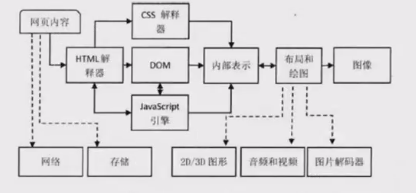

# 浏览器渲染原理

本质上，浏览器是方便一般互联网用户通过界面解析和发送HTTP协议的软件


## 浏览器内核知识


### 浏览器内核定义

我们可以初步认为浏览器中**负责将表示页面的字符转换成可视化图像的模块**就是**浏览器内核**


### 网页内容的组成

- doctype：提供浏览器HTML版本信息，告诉浏览器用什么版本的协议解析
- head: HTML头部
  - meta：元数据信息
    - charset:  此特性声明当前文档所使用的字符编码
    - http-equiv: 客户端行为，如渲染模式，缓存等
    - name[keywords]: 搜索引擎使用
    - name[description]: 搜索引擎使用
    - name[viewport]: **浏览器视口设置**
  - link
  - script：需要在body前完成加载或运行的脚本
- body: HTML实体
  - script：需要在body解析时加载或运行的脚本




#### 重要组件

- HTML解释器：解释HTML文本的解释器。HTML文本 -> DOM树
- CSS解释器：遇到级联样式表时，需要使用级联样式表解释器。为DOM对象计算出样式信息
- JavaScript引擎：遇到JS代码时，需要使用JavaScript解释器，并使得JS代码有调用DOM接口和CSSOM的能力
- 布局：结合CSS，计算出每个DOM对象的大小位置信息
- 绘图：将经过布局计算的DOM节点绘制成图像


## 浏览器渲染原理

总共分为两步：

1.加载：加载渲染所必须的HTML代码

2.渲染：将HTML代码绘制成图像结果


### **加载**

**资源加载机制**

***资源加载器***

分为3类

- 特定资源加载器：针对每种资源类型的特定加载器，仅加载某一种资源。对应设计模式中的单例模式。
- 缓存资源加载器：与常规的缓存逻辑相同，特定加载器先通过缓存资源加载器来查找是否有缓存资源，如果在资源缓存池中存在缓存资源，则取出以便使用；若不存在，发送请求给网络模块。
- 通用资源加载器：由于加载资源大多属于网络请求，二网络请求的逻辑是可以被特定资源加载器所共享的，所以通过通用资源加载器只负责通过网络获得目标资源的数据，但不负责进一步解析。

**资源缓存**

- Page Cache: 页面缓存
- Memory Cache: 内存缓存
- Disk Cache: 磁盘缓存


## 输入URL后浏览器做了什么


### 网络栈

1. **确定请求类型，协议**
2. **判断是否需要建立网络连接，查找强缓存**
3. **建立HTTP事物**
4. **建立TCP socket连接**
5. **套接字连接**

### 预先加载

1. DNS预取
2. 资源预取
3. TCP preconnect


### 渲染

资源的变换：

1. 字节流
2. 字符流
3. Tokens
4. 节点
5. DOM树

流程：

1. 词法分析
2. XSSAuditor
3. 语法分析
4. 生成DOM树
5. 生成CSSOM树
6. 构建render树
7. 布局render树(Layout)
8. 绘制render树(Paint)

**词法分析**

通过HTMLTokenizer来进行词法分析

词法分析的任务是对输入字节流进行逐字扫描，根据构词规则识别单词和符号，分词

词法分析器的主要接口是nextToken()函数，调用者只需要将字符串传入，就会得到一个词语

注意，在这里并不涉及标签类型信息，这是之后语法分析的工作


## **流程详情**

1. **构建请求**

   输入URL后，主进程中的 UI 线程接受到用户的 URL，判断用户输入的是 query 还是 URL。如果是 URL，把 URL 转发给网络线程，网络线程会构建请求行信息，构建好之后，浏览器就准备发起网络请求

   

2. **查找强缓存**

   浏览器在发起真正的网络请求前，会**先检查浏览器的强缓存，如果命中，直接返回对应资源文件的副本**。否则进入下一步。

   > **什么是强缓存？**
   >
   > 浏览的缓存策略分为**强缓存**和**协商缓存**，他们之间的根本区别是**是否需要发请求**。简单来说，强缓存就是你的本地文件（保存在硬盘或者内存中），你可以**立马访问到**；协商缓存是需要发请求给服务器，问问资源是否有更新，**如果没有更新就访问本地缓存；如果更新，服务器会返回更新后的资源文件**。
   >
   > 
   >
   > **强缓存的实现**
   >
   > 在 HTTP/1.0 时代，强缓存是通过 HTTP 响应头中 **Expires** 字段实现的，Expires 的意思是过期，所以这个字段的内容就是一个**绝对的失效时间**，例如 `Expires:Wed, 05 Apr 2020 00:55:35 GMT`。浏览器通过这个失效时间和用户的**本地时间**相比较来判定是否读取缓存中的资源副本，这就带来一个很明显的问题，用户可以自己修改本地时间，使缓存失效。
   >
   > 所以 HTTP/1.1 中新加入了 **Cache-Control** 字段来解决这个问题，通过设置 `cache-control: max-age=XXX` ，可以实现缓存在 XXX 秒后过期（**相对时间**），这样就规避了用户可以自己篡改本地时间使缓存失效的问题。
   >
   > 在 `cache-control` 和 `Expires` 同时存在时，以 `cache-control` 优先。

   

3. **DNS解析**

   发送真正网络请求首先需要进行 DNS 解析，目的就是**找到 URL 对应的服务器 IP 地址**。关于 DNS 解析的过程，大致是先查找本地 DNS 缓存，找不到就问本地 DNS 服务器，再依次问根域 DNS 服务器，一级域名服务器，二级域名服务器，最后把找到的 IP 地址层层传递回来。

   

4. **建立TCP连接**

   知道服务器的 IP 地址后，就可以跟服务器正式建立连接了，连接的方式分为两种，可靠的 TCP 和不可靠的 UDP，HTTP 协议是基于 TCP 的，所以需要跟服务器建立 TCP 连接。

   之所以是三次握手，是因为**浏览器和服务器都需要确认对方有正常的收发能力**。如果两次握手的话，客户端能知道服务端能收能发，但服务端只能知道客户端能发送数据，**并不知道客户端接受数据是没问题的**

   

5. **发送请求，收到响应**

   建立了 TCP 连接，浏览器就可以和服务器进行通信了，HTTP 中的数据就是在这个通信过程中传输的。

   服务器会通过响应行中的**状态码**告诉浏览器它的处理结果，常见的状态码有以下几类：

   - 2XX：成功，最常见的是 200 OK

   - 3XX：需要进一步操作，比如 301 永久重定向，302 临时重定向，304 未修改

   - 4XX：请求出错，比如最常见的 404 未找到资源，还有 403 禁止请求

   - 5XX：服务器出错，比如 500 服务器内部错误，502 网关错误

     

6. **查找协商缓存**

   在上一步中如果 HTTP 响应行中的状态码为 304 (Not Modified 未修改)，内容为空时，那么就相当于告诉浏览器“**服务器上的资源跟你本地缓存的副本一样，从缓存中拿就行啦**”。这就是协商缓存的流程，**当强缓存过期**，或者 `cache-control` 设置 `no-cache` 时，就会进行协商缓存，浏览器会发送请求到服务器，根据响应头中的状态码判断是否要从缓存中读取。

   > **协商缓存的实现**
   >
   > 协商缓存是通过 HTTP/1.0 中的 **Last-Modified** 和 HTTP/1.1 中的 **E-Tag** 实现的。
   >
   > 
   >
   > **Last-Modified 验证规则**：浏览器第一次发送请求，服务器在响应头中带上 `Last-Modified`，并返回资源，浏览器下次发送相同请求时，会把之前收到的 `Last-Modified` 内容放到请求头中的 `If-Modified-Since` 字段，服务器收到后会跟请求资源的最后修改时间做对比，如果相同，返回 HTTP 304，如果不相同，返回HTTP 200，并返回最新的资源。
   >
   > 
   >
   > **E-Tag 验证规则**：验证过程跟 `Last-Modified` 类似，只不过是浏览器第一次收到的是 `etag`，第二次发送的是 `If-None-Match`。跟 `Last-Modified` 的区别是 `E-Tag` 的内容是资源的唯一标识符，`Last-Modified` 的内容是最后修改时间，且 E-Tag 优先级高于 Last-Modified。
   >
   > 既然功能一样，为什么 HTTP/1.1 要引入 E-Tag 实现协商缓存呢？
   >
   > - 有些资源会被周期性的重写，但内容完全一样
   > - 有些资源可能被修改，但修改完全没必要让用户重新下载（修改注释或拼写）
   > - 有些资源的变化时间会小于一秒（比如实时监视器），所以 Last-Modified 的时间粒度不够了
   >
   > 这几种情况下，唯一标识资源的 E-Tag 就比 Last-Modified 管用啦。

   

7. **断开 TCP 连接**

   浏览器接受完服务器返回的资源后，需要断开 TCP 连接。断开 TCP 连接需要经历四次挥手。

   之所以要四次挥手，而不是三次，是因为**多了服务端通知客户端数据发送完毕的第三次挥手**。大家想想，如果没有第三次挥手，而是客户端直接确认关闭连接的第四次挥手，客户端就无法收到服务器还没发完的数据，导致**数据丢失**。

   

8. **解析 HTML，构建 DOM 树 (Construction of a DOM)**

   完成上面的网络请求过程后，接下来就是浏览器的渲染进程解析和渲染资源的过程了。首先对于 HTML 文件，浏览器由它生成 DOM 树（一种浏览器可以理解的树形结构，全称是 Document Object Model）。

   **构建 DOM 树通过以下四步**

   1. **转换 (Conversion)**。浏览器读取原始字节形式的 HTML，并按照指定的格式（例如 UTF-8）把这些字节翻译成单个字符。
   2. **序列化 (Tokenizing)**。浏览器把第一步得到的字符串转换成不同的标记，例如 `<html>`, `<body>` 等，每个标记都有自己的含义和规则。
   3. **词法分析 (Lexing)**。把这些标记转换为“对象”，来定义其属性和规则。
   4. **构建 DOM (DOM construction)**。因为 HTML 标签有特定的包含规则，比如 html 包含 body，body 包含 div，我们又通过上一步生成的对象知道了标签之间的父子关系，所以就可以构建出 DOM 树。

   

9. **样式计算，构建 CSSOM 树 (Style calculation)**

   样式计算的目的是为了计算出上面 DOM 节点中每个元素的具体样式，这个阶段大体可以分成三步：

   

   **1. 把 CSS 转化为浏览器能够理解的结构 styleSheets**

   跟 HTML 文本一样，浏览器是无法直接理解纯文本的 CSS 样式，所以**渲染进程在接受到 CSS 文本时，会先执行一个转化操作，将 CSS 文本转化成浏览器能够理解的结构 styleSheets**。

   

   **2. 转换样式表中的属性值，使其标准化**

   

   **3. 计算出 DOM 树中每个节点的具体样式**

   样式的属性已经被标准化了，接下来就是要计算 DOM 树中每个节点的样式属性了，如何计算呢？

   这里就会涉及到 CSS 的**继承规则**和**层叠规则**了。

   **首先是 CSS 继承**，CSS 继承就是每**个 DOM 节点都会继承其父节点的样式**。

   **其次是样式层叠**，CSS 的全称就叫“层叠样式表”。关于层叠顺序，这里又可以引出 CSS 选择器的优先级：

   - `内联style > id > class > 标签`
   - `内联style > 内部style > 外部CSS文件`
   - 一般来讲，越具体优先级越高，`!important` 的优先级最高，但是要**慎用**。

   经过计算后就会生成 CSSOM (CSS Object Model) 树

   

   浏览器处理 CSS 的过程，其实**跟 HTML 是很类似的，从字节开始，翻译成字符、序列化、生成节点，最终生成 CSSOM (CSS Object Model)。**

   

10. **布局 (Layout)**

    我们虽然有 DOM 树和 DOM 树中每个节点的样式，但还不知道这些 DOM 元素的几何位置，所以接下来就需要计算出 DOM 树中可见元素的几何位置。我们把这个计算过程叫做布局。布局阶段可以分成两个子阶段，**创建布局树**和**布局计算**。

    

    **构建布局树的过程**可以简单总结如下：

    - **遍历 DOM 树中的所有可见节点**，并把这些节点加到布局树中
    - **不可见节点会被布局树忽略**，如 `head` 标签下的全部内容，以及样式为 `display: none` 的元素

    构建完布局树，接下来就是**计算布局树节点的实际坐标**了。至于具体的计算过程非常的复杂，这里不加以记录。

    

11. **生成图层树 (Dividing into layers)**

    有了布局树，而且还计算除了每个元素的具体位置信息，那么接下来可以开始绘制了吗？其实不是的。**在绘制之前，还有一个生成图层树 (Layer Tree) 的过程**。

    为什么需要先生成图层树呢？**因为现代的前端页面有着非常复杂多样的效果，比如页面滚动、z-index 方向上的排序等，为了更加方便地实现这些效果，渲染进程还需要为特定的节点生成专用的图层，并生成一颗对应的图层树 (Layer Tree)。**

    

    **什么样的条件，渲染进程才会为特定节点创建新的图层呢**？

    

    **1. 拥有层叠上下文属性的元素会被提升为单独一层**

    页面是二维平面，但层叠上下文能够让 HTML 具有三维概念。这些 HTML 元素会按照他们的优先级分布在垂直于二维平面的 z 轴上。具体的优先级顺序如下：

    ```
    正z-index > z-index = 0 > inline > float > block > 负z-index > border > background
    ```

    > ### 层叠上下文的形成条件
    >
    > **文档中的层叠上下文由满足以下任意一个条件的元素形成**
    >
    > - 文档根元素
    > - position值为absolute或relative且z-index不为auto
    > - position值为fixed或sticky的元素
    > - flex容器的子元素，且z-index不为auto
    > - grid容器的子元素，且z-index不为auto
    > - opacity属性值小于1的元素
    > - mix-blend-mode属性值不为normal的元素
    > - 以下任意一个值不为none的元素
    >   - transform
    >   - filter
    >   - perspective
    >   - clip-path
    >   - mask/mask-image/mask-border
    >   - isolation属性值为isolate的元素
    >   - -webkit-overflow-scrolling属性值为touch的元素
    >   - will-change值设置了任一属性而该属性在non-initial值时会创建层叠上下文的元素
    >   - contain属性值为layout，paint或包含他们其中之一的合成值的元素

    

    **2. 需要裁剪的地方也会被创建为图层**

    裁剪的意思就是**要显示的内容超出它的容器**（比如 200 x 200 像素的 div 里面里面放着 1000 个字），另外如果出现滚动条，**滚动条也会被提升为单独的层**

    

12. **绘制 (Paint)**

    完成构建图层树之后，接下来就是渲染引擎对图层树中每个图层的绘制，具体的实现是渲染引擎会把一个图层的绘制拆分成很多小的**绘制指令**，然后再把这些指令按照顺序组成一个待绘制的列表。

    

13. ### 栅格化 (raster)

    生成绘制列表后，会进行**栅格化**。**绘制列表只是用来记录绘制顺序和绘制指令的列表，而实际上绘制操作是由渲染引擎中的合成线程来完成的**。

    当图层的绘制列表准备好之后，主线程会把该绘制列表**提交（commit）**给合成线程，那么接下来合成线程是怎么工作的呢？这里需要先引入一个做过 H5 手机页面开发的都会比较熟悉的标签：

```HTML
<meta name="viewport" content="width=device-width, initial-scale=1">
```

这里面的 viewport 就是用户可以实际看到的部分，中文翻译叫做**视口**。

**很多时候，页面的长度都是远大于屏幕高度的，所以图层都会比较大，但是通过视口，用户只能看到其中一部分内容，所以在这种情况下，要一次性绘制出所有图层内容的话，就会产生非常大的开销，而且也没有必要。**

基于这个原因，**合成线程会将图层划分为图块（tile），这些图块的大小通常是 256x256 或者 512x512**

然后**合成线程会按照视口附近的图块来优先生成位图，实际生成位图的操作就是由栅格化来执行的。所谓的栅格化，是指将图块转换为位图。**而图块是栅格化执行的最小单位。渲染进程维护了一个栅格化的线程池，所有的图块栅格化都是在线程池内执行的。

通常，**栅格化过程都会使用 GPU 来加速生成，使用 GPU 生成位图的过程叫快速栅格化，或者 GPU 栅格化，生成的位图被保存在 GPU 内存中。**


14. **合成与显示 (Composite and Display)**

    一旦所有图块都被光栅化，合成线程就会生成一个绘制图块的命令——“DrawQuad”，然后将该命令提交给浏览器进程。

    浏览器进程里面有一个叫 viz 的组件，用来接收合成线程发过来的 DrawQuad 命令，然后根据 DrawQuad 命令，将其页面内容绘制到内存中，最后再将内存显示在屏幕上。


### 渲染流程总结

一个完整的渲染流程大致可总结为如下：

1. 渲染进程将 HTML 内容转换为能够读懂的 **DOM 树**结构。
2. 渲染引擎将 CSS 样式表转化为浏览器可以理解的 **styleSheets**，计算并生成 **CSSOM 树**。
3. 创建**布局树**，并计算元素的布局信息。
4. 对布局树进行分层，并生成**图层树**。
5. 为每个图层生成**绘制列表**，并将其提交到合成线程。
6. 合成线程将图层分成**图块**，并在**光栅化线程池**中将图块转换成位图。
7. 合成线程发送绘制图块命令 **DrawQuad** 给浏览器进程。
8. 浏览器进程根据 DrawQuad 消息**生成页面**，并**显示**到显示器上。


