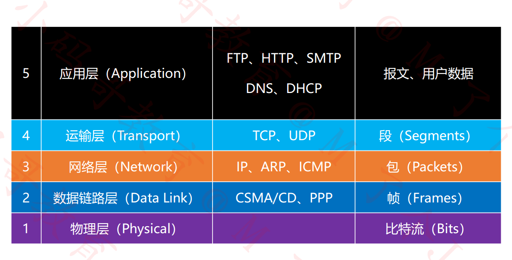
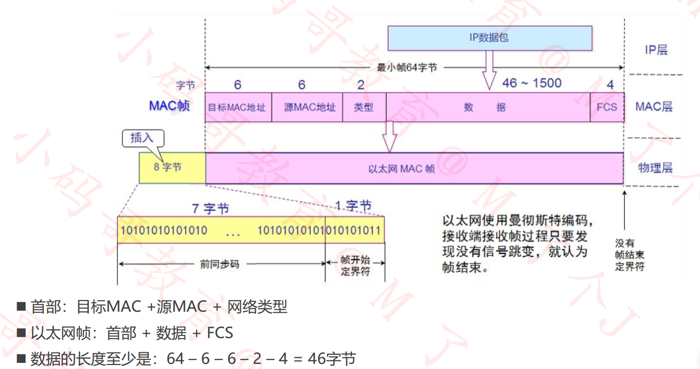
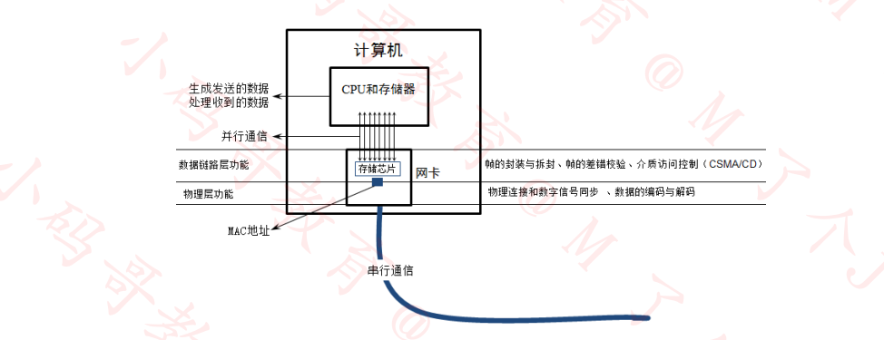

# 计算机网络

## 主机间通信

主机间通信可以直接用一条交叉线链接两台主机

主机间发包通过**ICMP**协议进行**IP**层面的通信

若不知道目标主机的 MAC 地址，在发**ICMP**之前需要发送\*\*ARP!

MAC 地址

每一个网卡都有一个 6 字节(48bit)的 MAC 地址

MAC 地址**全球唯一**，固化在了网卡的 ROM 当中，由 IEEE802 标准规定

前三个字节: OUI，组织唯一标识符，一般用来分辨厂商，由 IEEE 的注册管理机构分配给厂商

后三个字节: 由厂商自由分配

**当 48 位全部为 1 时，代表广播**

## IP 地址

互联网上每一个主机都有一个 IP 地址

最初版本是 IPv4 版本，32 bit(4 字节)，2019 年 11 月 25 日，全球的 IP 地址已经用完

后面推出了 IPv6 版本，128 bit(16 字节)

一般 IP 地址会用点分十进制的方法表示

IP 地址有两部分组成：**网络标识**，**主机标识**

通过子网掩码可以计算出网络标识(按位与[&])

### **5 类地址**

- A 类地址

  0 开头，网络号 8 位

- B 类地址

  10 开头，网络号 16 位

- C 类地址

  110 开头，网络号 24 位

- D 类地址

  1110 开头，多播地址

- E 类地址

  1111 开头，保留为今后拓展使用

### 子网掩码的 CIDR 表示方法

123.210.100.200/16 代表子网掩码有 16 个 1

### **划分子网**

**_为什么要进行子网划分?_**

如果需要让 200 台主机在同一个网段内，可以分配一个 C 类网段，比如 192.168.1.0/24

多出了 54 个空闲的 IP 地址，这种情况并不算浪费资源

但是如果需要让 500 台主机在同一个网段内，那么就分配一个 B 类网段比如 192.100.0.0/16

总共有 65534 个可用 IP 地址: 191.100.0.1 ~ 191.100.255.254

多出了 65034 个空闲的 IP 地址, 这种情况属于极大的资源浪费

这个时候就可以用到子网划分

子网划分可以分为**等长子网划分**和**变长子网划分**

- 等长子网划分：将一个网段等分为多个子网，每个子网的可用 IP 地址是一样的

  **等长子网划分-等分为两个子网**

  规律：如果一个子网是原来网络的 1/2，子网掩码往后移一位(用一位主机号来表示网络号)

  _例_

  192.168.0.0/24 划分为 2 个子网段

  A 子网: 192.168.0.128/25 子网掩码: 255.255.255.128

  主机:192.168.0.1 ~ 192.168.0.126 126 台

  B 子网: 192.168.0.0/25 子网掩码: 255.255.255.128

  主机:192.168.0.129 ~ 192.168.0.254 126 台

  

- 变长子网划分：每个子网的可用 IP 地址数量可以是不一样的

  如果一个子网地址块的长度是原网段的(1/2)^n，那么

  - 子网的子网掩码就是在原网段的子网掩码基础上增加 n 个 1
  - 不等长的子网，他们的子网掩码也不同

_例:_

A: 192.168.10.10/24 发包给 B: 192.168.10.10/16

虽然我们主观算出来两台主机在同一个网段内，但在 A 发包给 B 时，A 要判断 B 是否和自己在同一个网段，但是 A 并不知道 B 的子网掩码是多少，于是会用 A 自己的子网掩码算出 B 所在的网段，这样得出的结果二者是不在同一个网段的，所以无法通过局域网通信。

### 构造超网

超网：跟子网反过来，它是将多个**连续的网段**合并成**一个更大的网段**

需求：原本有 200 台计算机使用 192.168.0.0/24 网段，现在希望增加 200 台设备到同一网段

- 方法 1: 200 台在 192.168.0.0/24 网段，200 台在 192.168.1.0/24 网段(分配到不同网段)
- 方法 2: 合并 192.168.0.0/24 和 192.168.1.0/24 为一个网段: 192.168.0.0/23 (子网掩码往左移动一位)

**合并网段的规律**

假设 n 是 2 的 k 次幂(k>=1)

子网掩码左移 k 位能够合并 n 个网段(**不是任意连续的网段都能合并！**)

如果第一个网段的网络号能被 n 整除，那么由它开始连续的 n 个网段都能通过左移 k 位子网掩码进行合并(左移 k 位后网络号相同就代表可以合并)

### 判断一个网段是子网还是超网

首先

看看该网段的类型是 A 类网络，还是 B 类网络，或者 C 类网络

默认情况下 A 类网络的子网掩码是 8 位，B 类的是 16 位，C 类的是 24 位

然后

如果该网段的子网掩码位数比默认子网掩码**多**就是**子网**

如果该网段的子网掩码位数比默认子网掩码**少**就是**超网**

## ARP 协议

**ARP 协议会在主机间广播获取到各个主机的 MAC 地址与 IP 地址的映射**

ARP 地址在设备本地是有缓存的

## **ICMP 协议**

**ICMP 协议是一个网络层协议。**

一个新搭建好的网络，往往需要先进行一个简单的测试，来验证网络是否畅通；但是 IP 协议并不提供可靠传输。如果丢包了，IP 协议并不能通知传输层是否丢包以及丢包的原因，所以我们就需要一种协议来完成这样的功能–ICMP 协议。

ICMP 协议的功能主要有：

1. 确认 IP 包是否成功到达目标地址
2. 通知在发送过程中 IP 包被丢弃的原因
3. ICMP 是基于 IP 协议工作的，但是它并不是传输层的功能，因此仍然把它归结为网络层协议
4. ICMP 只能搭配 IPv4 使用，如果是 IPv6 的情况下, 需要是用 ICMPv6

## STP 协议(生成树协议)

**生成树协议工作原理**:任意一交换机中如果到达根网桥有两条或者两条以上的链路.生成树协议都根据算法仅仅保留一条，把其他切断，从而保证任意两个交换机之间只有一条单一的活动链路。因为这种生成的这种拓扑结构，很像是以根交换机为树干的树形结构.故为生成树协议。

**STP 的工作过程如下**：首先进行根网桥的选举，其依据是网桥优先级（bridge priority）和 MAC 地址组合生成的桥 ID，桥 ID 最小的网桥将成为网络中的根桥（bridge root）。在此基础上，计算每个节点到根桥的距离，并由这些路径得到各冗余链路的代价，选择最小的成为通信路径（相应的端口状态变为 forwarding），其它的就成为备份路径(相应的端口状态变为 blocking)。STP 生成过程中的通信任务由 BPDU 完成，这种数据包又分为包含配置信息的配置 BPDU（其大小不超过 35B）和包含拓扑变化信息的通知 BPDU（其长度不超过 4B）。

## 局域网内多台主机间的通信

### 总线形式

多台计算机连接在同一条同轴电缆，这种方式是半双工通信

同轴电缆的传播方式是广播，容易造成碰撞，可以借助**碰撞检测协议**来实现信息的传递

同轴电缆两端是电阻会吸收信号，避免信号回弹

容错率低，如果总线断了，那么信号可能不会遇到电阻造成信号回弹

一条总线连接的所有主机称为一个**冲突域**

### 集线器形式

用集线器把所有主机连起来，可以用集线器连接集线器，来拓展网络

容错率好，一台主机失联对全局影响不大

**集线器没有智商，给集线器发包，集线器只会把包发往其它所有连接的端口**

如果多台主机连在同一个集线器上，会造成发送过多的无用包导致性能浪费

### 网桥连接

**网桥连接能够通过自学习得知每个接口那侧的 MAC 地址**

网桥只有两个接口

网桥内部会有一个 MAC 地址表

| 端口 | MAC 地址 |
| ---- | -------- |
| L    | MAC(1)   |
| R    | MAC(2)   |
| L    | MAC(3)   |
| L    | MAC(4)   |
| R    | MAC(5)   |
| ...  | ...      |

网桥在转发数据包时，如果发现数据包的目的地和它来的端口是同一个端口，那么网桥不会转发这个包，从而起到**隔绝冲突域**的作用

### 交换机

相当于更多接口的网桥,也有**隔绝冲突域**的作用

**全双工通信**

**交换机是局域网的最终方案，若要跨网段，则要用到路由器**

交换机也会学习各个接口对应的 MAC 地址，若要转发的包在 MAC 地址表内找到匹配端口，则交换机只会把包转到对应的端口而不会影响其他端口

不在同一个网段的主机不能用交换机连接，连接了数据也发不过去

但是如果全球都用交换机连接是不可行的

1. 首先交换机连接的是同一个网段的主机，会造成 IP 地址不够用
2. ARP 广播会发给全球的人

**所以说如果要连接多个网络的话，交换机还是不能解决问题**

## 互联网内多台主机间的通信

网线直连，同轴电缆，集线器，网桥，交换机连接的设备必须在同一网段，连接的设备处在同一个广播域

### 路由器

路由器可以在不同网段之间转发数据

有**隔绝广播域**的作用

主机发送数据之前，首先会判断目标主机的 IP 地址是否跟它在同一个网段

- 在同一个网段：ARP，通过交换机，集线器发送数据
- 不在同一个网段：通过路由器转发数据

主机把数据包发往自己所处广播域的路由器的网关(默认网关), 然后路由器根据路由表进行转发

### 网关

如果想要跨网段发送数据，需要通过连接的路由器的网关

## **路由**

在不同网段之间转发数据，需要有路由器的支持

默认情况下，路由器只知道跟它直连的网段，非直连的网段需要通过静态路由，动态路由告诉他

### 静态路由

管理员手动添加的路由信息

适用于小规模网络

### 动态路由

路由器通过**路由选择协议**(比如 RIP，OSPF)自动获取路由信息

适用于大规模网络

## 网络分层

### OSI 参考模型

参考标准模型

- 应用层
- 表示层
- 会话层
- 运输层
- 网络层
- 数据链路层
- 物理层

### TCP/IP 协议模型

实战性模型

- 应用层
- 运输层
- 网际层
- 网络接口层(有些人会把这层拆成**数据链路层**和**物理层**)

### **物理层**

物理层定义了接口标准，线缆标准，传输速率，传输方式等

#### **模拟信号**

连续的信号，适合长距离传输

抗干扰能力差，收到干扰时波形变形很难纠正

#### **数字信号**

离散的信号，不适合长距离传输

抗干扰能力强，受到干扰时失真可以修复

#### **数据通信模型**

> 局域网通信模型
>
> PC -数字信号- 集线器 -数字信号- PC

> 广域网通信模型
>
> PC -数字信号- 调制解调器 -模拟信号- 调制解调器 - 数字信号 - PC

#### **信道(Channel)**

信道：信息传输的通道，一条传输介质上(比如网线)上可以有多条信道

_单工通信_

信号只能往一个方向传输，任何时候都不能改变信号的传输方向

比如无线电广播，有线电视广播

_半双工通信_

信号可以双向传输，但必须是交替进行，同一时间只能往一个方向传输

比如对讲机

_全双工通信_

信号可以同时双向传输

比如手机

### **数据链路层**

#### **链路**：

从一个节点到相邻节点的一段物理线路(有线或者无线)，中间没有其他交换节点(集线器不算交换节点)

#### **数据链路**：

在一条链路上传输数据时，需要有对应的通信协议来控制数据的传输，不同类型的数据链路，所用的通信协议可能是不同的

广播信道：CSMA/CD 协议(比如同轴电缆，集线器等组成的网络)

点对点信道：PPP 协议(比如两个路由器之间的信道)

数据链路层的 3 个基本问题

#### **封装成帧**

帧的数据部分就是网络层传递下来的数据包(IP 数据包，packet)

_最大传输单元 MTU_

每一种数据链路层协议都规定了所能够传送的帧的数据长度上限

以太网的 MTU 为 1500 个字节

#### **透明传输**

数据部分一旦出现了 SOH(帧开始符)，EOT(帧结束符)就需要进行转义，从而避免数据部分被误认为是帧分界符，内容部分出现转义符号需要再次进行转义

透明传输的方案：字节填充，零比特填充法

#### **差错检验**

**FCS(帧校验序列)**通过帧的数据部分和数据链路层首部计算得出

在接收方收到帧后会再次计算 FCS, 若和对应的帧尾部 FCS 不同则说明帧的数据发生了失真，接收方的网卡会把这个包丢弃

#### **CSMA/CD 协议**

载波监听多路访问/碰撞检测协议

载波监听：默认监听所在冲突域是否有人正在传输，如果有则不会马上发送数据

冲突检测：在发出数据后会开始计时，如果在发出数据并收到正常返回数据的最小时间内收到了数据，这说明发生了碰撞，此时设备会立即停止发送数据并且等待一段随机的时间后再发送数据

为了能够检测正在发送的帧是否发生了冲突，以太网帧的至少要 64 字节

用交换机组建的网络，已经支持全双工通信，不需要再使用 CSMA/CD 协议，但他传输的帧依然是以太网帧，所以用交换机组建的网络，依然可以叫做以太网

#### **Ethernet V2 帧(以太网帧)**

以太网使用曼彻斯特编码，接收端接收帧过程只要发现没有信号跳变，就认为帧结束，所以**以太网帧没有帧开始符和帧结束符**

物理层开始会给帧加上一个字节的前同步码，方便告知后面传输的数据是一个帧

当数据部分长度小于 46 字节时，数据链路层会在数据的后面加上一些字节填充，接收端在接受到这些数据后把填充的字节再去掉

以太网帧的**数据长度**：46~1500 字节

以太网帧的长度：64~1518 字节(目标 MAC+原 MAC+网络类型+数据+FCS)

#### PPP协议

Address字段：值为0xFF，形同虚设，点到点信道不需要源MAC、目标MAC地址

Control字段：目前没什么作用

Protocol字段：内部用到的协议类型

帧开始符，帧结束符：0x7E

**字节填充**：将0x7E替换成0x7D5E，将0x7D替换成0x7D5D

#### 网卡

网卡接受到一个帧，首先会进行差错校验，如果校验通过则接收，否则丢弃

### 网络层

#### IP数据包

网络层数据包(IP数据包，Packet)由**首部**，**数据**2部分组成

**数据**：很多时候是由传输层传递下来的数据段(Segment)

**首部**：固定部分(20个字节) + 可变部分(最多20字节) + 填充

​	**版本**：占4位

​	**首部长度**：占4位，二进制乘以4才是最终长度

​	**区分服务**：占8位，可以用于提高网络的服务质量

​	**总长度**：占16位，首部+数据的长度只和，最大值是65535

​	由于帧的数据不能超过1500字节，所以过大的IP数据包需要分成片	        	(fragments)传输给数据链路层，**每一片都有自己的网络层首部(IP首部)**

​	**标识**：占16位，数据包的ID，当数据包过大进行分片的时候，同一个数	据包的所有片都是一样的，有一个专门计数的计数器专门管理数据包的	ID，每发出一个数据包，ID就+1

​	**标志**：占3位，第一位保留，第二位1代表不允许分片，0代表允许分             	片，第三位1代表不是最后一片，0代表是最后一片

​	**片偏移**：占13位，片偏移乘以8就是字节偏移，每一片的长度一定是8的	整数倍，IP数据报数据部分的最大长度为1500字节-40字节(头部)=1460	字节

### ping

ping -s [bytes] 指定数据包大小

#### 

