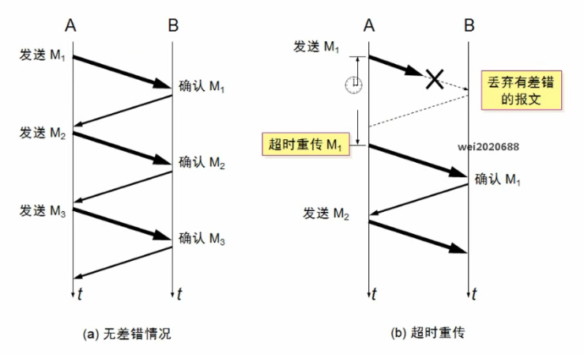
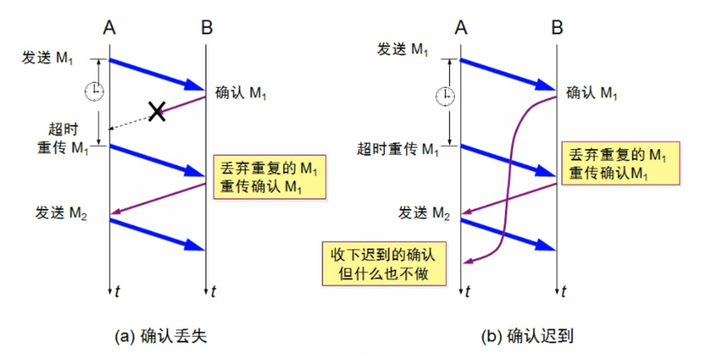
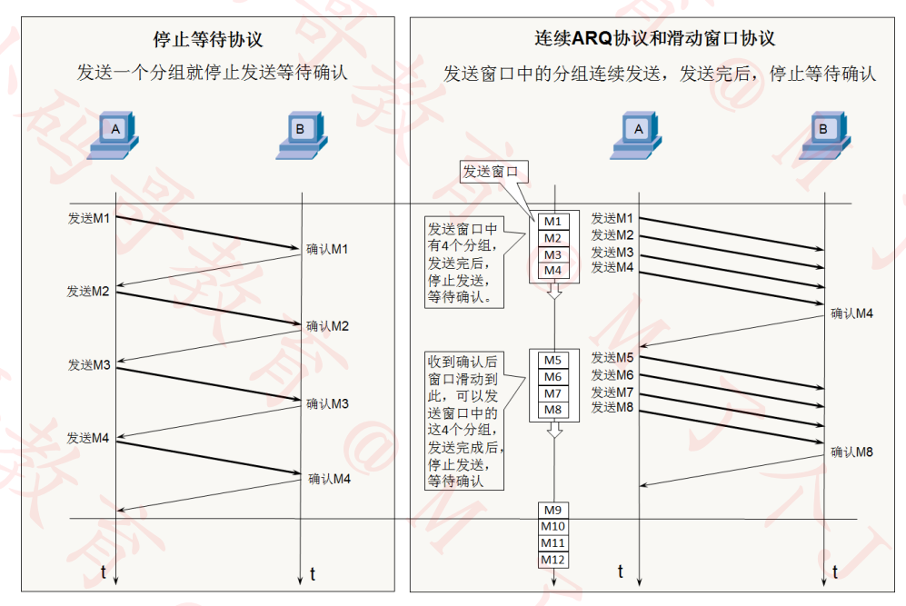
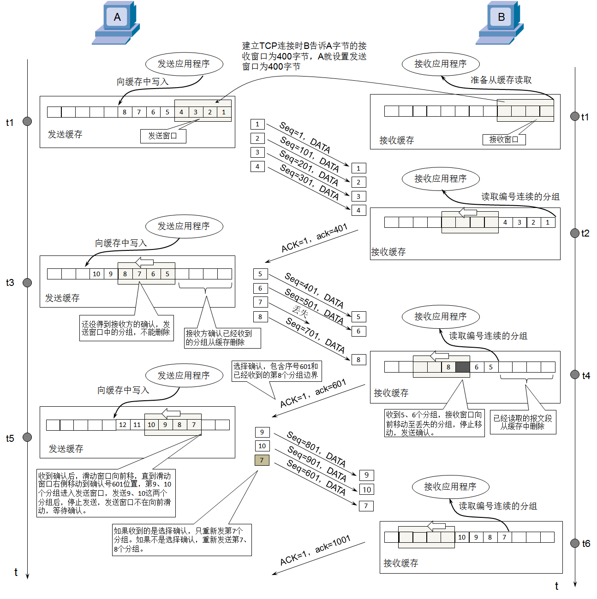
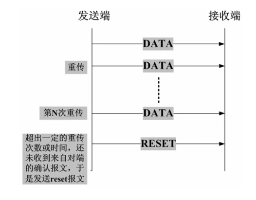
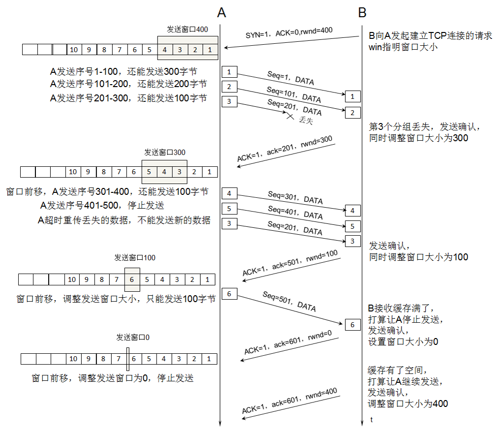

# 计算机网络


## 主机间通信

主机间通信可以直接用一条交叉线链接两台主机

主机间发包通过**ICMP**协议进行**IP**层面的通信

若不知道目标主机的 MAC 地址，在发**ICMP**之前需要发送**ARP**!

MAC 地址

每一个网卡都有一个 6 字节(48bit)的 MAC 地址

MAC 地址**全球唯一**，固化在了网卡的 ROM 当中，由 IEEE802 标准规定

前三个字节: OUI，组织唯一标识符，一般用来分辨厂商，由 IEEE 的注册管理机构分配给厂商

后三个字节: 由厂商自由分配

**当 48 位全部为 1 时，代表广播**

## IP 地址

互联网上每一个主机都有一个 IP 地址

最初版本是 IPv4 版本，32 bit(4 字节)，2019 年 11 月 25 日，全球的 IP 地址已经用完

后面推出了 IPv6 版本，128 bit(16 字节)

一般 IP 地址会用点分十进制的方法表示

IP 地址有两部分组成：**网络标识**，**主机标识**

通过子网掩码可以计算出网络标识(按位与[&])

### **5 类地址**

- A 类地址

  0 开头，网络号 8 位

- B 类地址

  10 开头，网络号 16 位

- C 类地址

  110 开头，网络号 24 位

- D 类地址

  1110 开头，多播地址

- E 类地址

  1111 开头，保留为今后拓展使用

### 子网掩码的 CIDR 表示方法

123.210.100.200/16 代表子网掩码有 16 个 1


### **划分子网**

**_为什么要进行子网划分?_**

如果需要让 200 台主机在同一个网段内，可以分配一个 C 类网段，比如 192.168.1.0/24

多出了 54 个空闲的 IP 地址，这种情况并不算浪费资源

但是如果需要让 500 台主机在同一个网段内，那么就分配一个 B 类网段比如 192.100.0.0/16

总共有 65534 个可用 IP 地址: 191.100.0.1 ~ 191.100.255.254

多出了 65034 个空闲的 IP 地址, 这种情况属于极大的资源浪费

这个时候就可以用到子网划分

子网划分可以分为**等长子网划分**和**变长子网划分**

- 等长子网划分：将一个网段等分为多个子网，每个子网的可用 IP 地址是一样的

  **等长子网划分-等分为两个子网**

  规律：如果一个子网是原来网络的 1/2，子网掩码往后移一位(用一位主机号来表示网络号)

  _例_

  192.168.0.0/24 划分为 2 个子网段

  A 子网: 192.168.0.128/25 子网掩码: 255.255.255.128

  主机:192.168.0.1 ~ 192.168.0.126 126 台

  B 子网: 192.168.0.0/25 子网掩码: 255.255.255.128

  主机:192.168.0.129 ~ 192.168.0.254 126 台

  

- 变长子网划分：每个子网的可用 IP 地址数量可以是不一样的

  如果一个子网地址块的长度是原网段的(1/2)^n，那么

  - 子网的子网掩码就是在原网段的子网掩码基础上增加 n 个 1
  - 不等长的子网，他们的子网掩码也不同

_例:_

A: 192.168.10.10/24 发包给 B: 192.168.10.10/16

虽然我们主观算出来两台主机在同一个网段内，但在 A 发包给 B 时，A 要判断 B 是否和自己在同一个网段，但是 A 并不知道 B 的子网掩码是多少，于是会用 A 自己的子网掩码算出 B 所在的网段，这样得出的结果二者是不在同一个网段的，所以无法通过局域网通信。


### 构造超网

超网：跟子网反过来，它是将多个**连续的网段**合并成**一个更大的网段**

需求：原本有 200 台计算机使用 192.168.0.0/24 网段，现在希望增加 200 台设备到同一网段

- 方法 1: 200 台在 192.168.0.0/24 网段，200 台在 192.168.1.0/24 网段(分配到不同网段)
- 方法 2: 合并 192.168.0.0/24 和 192.168.1.0/24 为一个网段: 192.168.0.0/23 (子网掩码往左移动一位)

**合并网段的规律**

假设 n 是 2 的 k 次幂(k>=1)

子网掩码左移 k 位能够合并 n 个网段(**不是任意连续的网段都能合并！**)

如果第一个网段的网络号能被 n 整除，那么由它开始连续的 n 个网段都能通过左移 k 位子网掩码进行合并(左移 k 位后网络号相同就代表可以合并)


### 判断一个网段是子网还是超网

首先

看看该网段的类型是 A 类网络，还是 B 类网络，或者 C 类网络

默认情况下 A 类网络的子网掩码是 8 位，B 类的是 16 位，C 类的是 24 位

然后

如果该网段的子网掩码位数比默认子网掩码**多**就是**子网**

如果该网段的子网掩码位数比默认子网掩码**少**就是**超网**


## ARP 协议

**ARP 协议会在主机间广播获取到各个主机的 MAC 地址与 IP 地址的映射**

ARP 地址在设备本地是有缓存的


## **ICMP 协议**

**ICMP 协议是一个网络层协议。**

一个新搭建好的网络，往往需要先进行一个简单的测试，来验证网络是否畅通；但是 IP 协议并不提供可靠传输。如果丢包了，IP 协议并不能通知传输层是否丢包以及丢包的原因，所以我们就需要一种协议来完成这样的功能–ICMP 协议。

ICMP 协议的功能主要有：

1. 确认 IP 包是否成功到达目标地址
2. 通知在发送过程中 IP 包被丢弃的原因
3. ICMP 是基于 IP 协议工作的，但是它并不是传输层的功能，因此仍然把它归结为网络层协议
4. ICMP 只能搭配 IPv4 使用，如果是 IPv6 的情况下, 需要是用 ICMPv6


## STP 协议(生成树协议)

**生成树协议工作原理**:任意一交换机中如果到达根网桥有两条或者两条以上的链路.生成树协议都根据算法仅仅保留一条，把其他切断，从而保证任意两个交换机之间只有一条单一的活动链路。因为这种生成的这种拓扑结构，很像是以根交换机为树干的树形结构.故为生成树协议。

**STP 的工作过程如下**：首先进行根网桥的选举，其依据是网桥优先级（bridge priority）和 MAC 地址组合生成的桥 ID，桥 ID 最小的网桥将成为网络中的根桥（bridge root）。在此基础上，计算每个节点到根桥的距离，并由这些路径得到各冗余链路的代价，选择最小的成为通信路径（相应的端口状态变为 forwarding），其它的就成为备份路径(相应的端口状态变为 blocking)。STP 生成过程中的通信任务由 BPDU 完成，这种数据包又分为包含配置信息的配置 BPDU（其大小不超过 35B）和包含拓扑变化信息的通知 BPDU（其长度不超过 4B）。


## 局域网内多台主机间的通信


### 总线形式

多台计算机连接在同一条同轴电缆，这种方式是半双工通信

同轴电缆的传播方式是广播，容易造成碰撞，可以借助**碰撞检测协议**来实现信息的传递

同轴电缆两端是电阻会吸收信号，避免信号回弹

容错率低，如果总线断了，那么信号可能不会遇到电阻造成信号回弹

一条总线连接的所有主机称为一个**冲突域**


### 集线器形式

用集线器把所有主机连起来，可以用集线器连接集线器，来拓展网络

容错率好，一台主机失联对全局影响不大

**集线器没有智商，给集线器发包，集线器只会把包发往其它所有连接的端口**

如果多台主机连在同一个集线器上，会造成发送过多的无用包导致性能浪费


### 网桥连接

**网桥连接能够通过自学习得知每个接口那侧的 MAC 地址**

网桥只有两个接口

网桥内部会有一个 MAC 地址表

| 端口 | MAC 地址 |
| ---- | -------- |
| L    | MAC(1)   |
| R    | MAC(2)   |
| L    | MAC(3)   |
| L    | MAC(4)   |
| R    | MAC(5)   |
| ...  | ...      |

网桥在转发数据包时，如果发现数据包的目的地和它来的端口是同一个端口，那么网桥不会转发这个包，从而起到**隔绝冲突域**的作用


### 交换机

相当于更多接口的网桥,也有**隔绝冲突域**的作用

**全双工通信**

**交换机是局域网的最终方案，若要跨网段，则要用到路由器**

交换机也会学习各个接口对应的 MAC 地址，若要转发的包在 MAC 地址表内找到匹配端口，则交换机只会把包转到对应的端口而不会影响其他端口

不在同一个网段的主机不能用交换机连接，连接了数据也发不过去

但是如果全球都用交换机连接是不可行的

1. 首先交换机连接的是同一个网段的主机，会造成 IP 地址不够用
2. ARP 广播会发给全球的人

**所以说如果要连接多个网络的话，交换机还是不能解决问题**


## 互联网内多台主机间的通信

网线直连，同轴电缆，集线器，网桥，交换机连接的设备必须在同一网段，连接的设备处在同一个广播域


### 路由器

路由器可以在不同网段之间转发数据

有**隔绝广播域**的作用

主机发送数据之前，首先会判断目标主机的 IP 地址是否跟它在同一个网段

- 在同一个网段：ARP，通过交换机，集线器发送数据
- 不在同一个网段：通过路由器转发数据

主机把数据包发往自己所处广播域的路由器的网关(默认网关), 然后路由器根据路由表进行转发


### 网关

如果想要跨网段发送数据，需要通过连接的路由器的网关


## **路由**

在不同网段之间转发数据，需要有路由器的支持

默认情况下，路由器只知道跟它直连的网段，非直连的网段需要通过静态路由，动态路由告诉他


### 静态路由

管理员手动添加的路由信息

适用于小规模网络


### 动态路由

路由器通过**路由选择协议**(比如 RIP，OSPF)自动获取路由信息

适用于大规模网络


## 网络分层


### OSI 参考模型

参考标准模型

- 应用层
- 表示层
- 会话层
- 运输层
- 网络层
- 数据链路层
- 物理层


### TCP/IP 协议模型

实战性模型

- 应用层
- 运输层
- 网际层
- 网络接口层(有些人会把这层拆成**数据链路层**和**物理层**)


### **物理层**

物理层定义了接口标准，线缆标准，传输速率，传输方式等

#### **模拟信号**

连续的信号，适合长距离传输

抗干扰能力差，收到干扰时波形变形很难纠正

#### **数字信号**

离散的信号，不适合长距离传输

抗干扰能力强，受到干扰时失真可以修复

#### **数据通信模型**

> 局域网通信模型
>
> PC -数字信号- 集线器 -数字信号- PC

> 广域网通信模型
>
> PC -数字信号- 调制解调器 -模拟信号- 调制解调器 - 数字信号 - PC

#### **信道(Channel)**

信道：信息传输的通道，一条传输介质上(比如网线)上可以有多条信道

_单工通信_

信号只能往一个方向传输，任何时候都不能改变信号的传输方向

比如无线电广播，有线电视广播

_半双工通信_

信号可以双向传输，但必须是交替进行，同一时间只能往一个方向传输

比如对讲机

_全双工通信_

信号可以同时双向传输

比如手机


### **数据链路层**


#### **链路**

从一个节点到相邻节点的一段物理线路(有线或者无线)，中间没有其他交换节点(集线器不算交换节点)


#### **数据链路**

在一条链路上传输数据时，需要有对应的通信协议来控制数据的传输，不同类型的数据链路，所用的通信协议可能是不同的

广播信道：CSMA/CD 协议(比如同轴电缆，集线器等组成的网络)

点对点信道：PPP 协议(比如两个路由器之间的信道)


数据链路层的 3 个基本问题

#### **封装成帧**

帧的数据部分就是网络层传递下来的数据包(IP 数据包，packet)

_最大传输单元 MTU_

每一种数据链路层协议都规定了所能够传送的帧的数据长度上限

以太网的 MTU 为 1500 个字节


#### **透明传输**

数据部分一旦出现了 SOH(帧开始符)，EOT(帧结束符)就需要进行转义，从而避免数据部分被误认为是帧分界符，内容部分出现转义符号需要再次进行转义

透明传输的方案：字节填充，零比特填充法


#### **差错检验**

**FCS(帧校验序列)**通过帧的数据部分和数据链路层首部计算得出

在接收方收到帧后会再次计算 FCS, 若和对应的帧尾部 FCS 不同则说明帧的数据发生了失真，接收方的网卡会把这个包丢弃


#### **CSMA/CD 协议**

载波监听多路访问/碰撞检测协议

载波监听：默认监听所在冲突域是否有人正在传输，如果有则不会马上发送数据

冲突检测：在发出数据后会开始计时，如果在发出数据并收到正常返回数据的最小时间内收到了数据，这说明发生了碰撞，此时设备会立即停止发送数据并且等待一段随机的时间后再发送数据

为了能够检测正在发送的帧是否发生了冲突，以太网帧的至少要 64 字节

用交换机组建的网络，已经支持全双工通信，不需要再使用 CSMA/CD 协议，但他传输的帧依然是以太网帧，所以用交换机组建的网络，依然可以叫做以太网


#### **Ethernet V2 帧(以太网帧)**


以太网使用曼彻斯特编码，接收端接收帧过程只要发现没有信号跳变，就认为帧结束，所以**以太网帧没有帧开始符和帧结束符**

物理层开始会给帧加上一个字节的前同步码，方便告知后面传输的数据是一个帧

当数据部分长度小于 46 字节时，数据链路层会在数据的后面加上一些字节填充，接收端在接受到这些数据后把填充的字节再去掉

以太网帧的**数据长度**：46~1500 字节

以太网帧的长度：64~1518 字节(目标 MAC+原 MAC+网络类型+数据+FCS)


#### PPP协议

Address字段：值为0xFF，形同虚设，点到点信道不需要源MAC、目标MAC地址

Control字段：目前没什么作用

Protocol字段：内部用到的协议类型

帧开始符，帧结束符：0x7E

**字节填充**：将0x7E替换成0x7D5E，将0x7D替换成0x7D5D


#### 网卡


网卡接受到一个帧，首先会进行差错校验，如果校验通过则接收，否则丢弃

### 网络层


#### IP数据包

网络层数据包(IP数据包，Packet)由**首部**，**数据**2部分组成

**数据**：很多时候是由传输层传递下来的数据段(Segment)

**首部**：固定部分(20个字节) + 可变部分(最多20字节) + 填充

​	**版本**：占4位

​	**首部长度**：占4位，表示IP首部的长度，二进制乘以4才是最终长度

​	**区分服务**：占8位，可以用于提高网络的服务质量

​	**总长度**：占16位，首部+数据的长度只和，最大值是65535

​	由于帧的数据不能超过1500字节，所以过大的IP数据包需要分成片(fragments)传输给数	据链路层，**每一片都有自己的网络层首部(IP首部)**

​	**标识**：占16位，数据包的ID，当数据包过大进行分片的时候，同一个数	据包的所有片都	是一样的，有一个专门计数的计数器专门管理数据包的ID，每发出一个数据包，ID就+1

​	**标志**：占3位，第一位保留，第二位1代表不允许分片，0代表允许分片，第三位1代表不是	最后一片，0代表是最后一片

​	**片偏移**：占13位，片偏移乘以8就是字节偏移，每一片的长度一定是8的整数倍，IP数据	报数据部分的最大长度为1500字节-40字节(头部)=1460	字节

​	**生存时间**：占8位，每个路由器会在转发之前将TTL减一，一旦发现TTL减为零，路由器会	返回错误报告

​	**协议**：占8位，表明封装的数据使用了什么协议

					 	

​	**首部检验和**：占16位，检查首部是否有错误

​	**原IP地址**：占32位，表示原始IP地址

​	**目标IP地址**：占32位，表示目标IP地址

​	**可变部分头部**


### **传输层**

传输层有两个协议：TCP，UDP

#### **TCP-传输控制协议**

面向连接

可靠传输，不丢包

首部占用空间大

传输速率慢

资源消耗大

应用场景：浏览器，文件传输，邮件发送

应用层协议：HTTP, HTTPS, FTP, SMTP, DNS


#### **TCP-首部格式**

**源端口**：占16位，代表原端口号， 0~65535

**目的端口**：占16位，代表目的端口号， 0~65535

**序号(Seq)**：占32位，首先，传输的过程中，每一个字节都有一个编号，在建立连接后，序号代表这一次传给对方的TCP数据部分的第一个字节的编号

**确认号(Ack)**：占32位，在建立连接后，期望对方下一次传过来的TCP数据部分的第一个字节的编号

**数据偏移**：占4位，数据偏移乘以4才是首部长度，首部长度是20~60字节

**保留**：占3+3位(有3位Flags没用也当作保留位)

**URG**：占1位, 当URG=1的时候紧急指针才起作用，表明当前报文段中有紧急数据，应该尽快传输

**ACK**：占1位，当ACK=1时，确认号才起作用

**PSH**：占1位，*交互式网络上才起作用

**RST**：占1位，当RST=1时，表明连接中出现严重差错，必须释放连接，然后再重新建立连接

**SYN**：占1位，当SYN=1, ACK=0时，表明这是一个建立连接的请求，若对方同意连接，则回复SYN=1,ACK=1

**FIN**：占1位，当FIN=1时，表明数据已经发送完毕，要求释放连接

**窗口**：占16位，这个字段有**流量控制**功能，用以告知对方下一次允许发送的数据大小(字节为单位)

**检验和**：占16位，和UDP一样是伪首部(12字节，原IP+目标IP+保留位固定为0+协议(6)+TCP长度)+首部+数据

**紧急指针**：占16位，一般放的是一个长度x，代表TCP数据前x位是紧急数据


#### **TCP-可靠传输**

**停止等待ARQ协议**

ARQ(Auto Repeat-reQuest)自动重传

保证了可靠传输但是效率太低了






***连续*ARQ协议+滑动窗口协议**






 如果有包丢失，且发送端收到的是**选择确认**，则只会重发丢失的包


**选择确认-SACK**

在TCP通信过程中，如果发送序列中间某个数据包丢失(比如1,2,3,4,5中的**3**丢失了)，TCP会通过重传最后确认的分组后续的分组(最后确认的是2,会重传**3**,4,5)，这样原先已经正确传输的分组也可能重新发送(比如4,5)，降低了TCP性能。

为了改善上述情况，发展出了**SACK(选择确认)**技术

告诉发送方哪些数据丢失，哪些数据已经提前收到，使TCP只重新发送丢失的包(比如**3**)，不用发送后续所有的分组(比如4,5)

SACK会放在TCP首部的选项部分

**Kind**: 占8位。值为5代表这是SACK选项

**Length**: 占8位。表明SACK选项一共占用多少字节

**LeftEdge**: 占4字节，左边界

**RightEdge**: 占4字节，右边界

左右边界要连续排列，可以有多个左右边界，最多有4组边界信息(40-2)//(4+4) = 4

左右 左右 左右 左右


**如果有个包重传了N次还是失败，会一直持续重传到成功为止吗？**

这个取决于系统的设置，比如有些系统，重传5次还没有成功就会发送reset报文(RST)断开连接

  


**为什么选择在传输层就将数据大卸八块分成多段，而不是等到网络层再分片传递给数据链路层？**

因为可以提高重传的性能

需要明确的是：可靠传输是在传输层进行控制的

如果在传输层不分段，一旦出现数据丢失，整个传输层的数据都得重传

如果在传输层分了段，一旦出现数据丢失，只需要重传丢失的那些段就可以了 


#### **TCP-流量控制**

如果接收方的缓存区满了，发送方还在疯狂发送数据，接收方就只能把收到的数据包丢掉，大量的丢包会极大着浪费网络资源，所以要进行**流量控制**


 **什么是流量控制**

让发送方的发送速率不要太快，让接收方来得及接收处理




**原理**

通过确认报文中窗口字段来控制发送方的发送速率

发送方的发送窗口不能超过接收方给出的窗口大小

当发送方收到接受窗口的大小为0时，发送方就会停止发送数据


**特殊情况**

一开始，接收方给发送方发送了0窗口的报文段，后来接收方又有了有一些存储空间，给发送方发送的非0窗口的报文段丢失了，发送方的发送窗口一直为0,双方陷入僵局

*解决方案*：当发送方收到0窗口通知时，这是发送方停止发送报文，并且同时开启一个定时器，隔一段时间就发个测试报文去询问接收方最新的窗口大小，如果接受的窗口大小还是0,则发送方再次刷新启动定时器


#### **TCP-拥塞控制**

拥塞控制可以防止过多的数据注入到网络中，避免网络中的路由器或者链路过载

拥塞控制是一个全局性的过程，涉及到所有的主机和路由器以及与降低网络传输性能有关的所有因素，是大家共同努力的结果

相比而言，流量控制是点对点通信的控制


**缩写**

- MSS (Maximum Segment Size): 每个段最大的数据部分的大小，在建立连接时确定 
- cwnd(congestion window): 拥塞窗口
- rwnd(receive window): 接收窗口
- swnd(send window): 发送窗口，swnd = min(cwnd, rwnd)


**拥塞控制的方法**

- **慢开始**

  一开始把发送窗口设置为1 MSS，在确保每次发送的数据都得到正确的响应后，每次将发送窗口翻倍，这样的话cwnd一开始比较小，随着发送窗口的增大网络上的数据变多，cwnd开始成倍增长

  

- **拥塞避免**

  随着包的每次往返，拥塞窗口也会指数级增长，拥堵状况激增甚至导致网络堵塞。为了防止这些，引入了**慢开始阀值(ssthresh)**的概念。只要拥塞窗口的值超出这个阀值，在每收到一次应答时，只允许以 **(1个数据段的字节数) / (cwnd的字节数) * 1个数据段的字节数**这个比例线性放大拥塞窗口.

  **乘法减小**：只要网络出现拥塞，就把ssthresh减半，与此同时，执行慢开始算法(cwnd又恢复到初始值)

  

- **快速重传**

  接收方：每收到一个失序的分组后，就**立即**发出3个重复确认

  发送发：连续收到3个已发送的分组的重复确认就立即重传丢失的分组

  

- **快速恢复**

  在拥塞避免时收到3个重复的确认执行快重传算法，得知丢包了，于是就把ssthresh减半，与此同时，我们把cwnd值设置为ssthresh减半后的数值，然后继续拥塞避免

发送窗口的最大值：swnd = min(cwnd, rwnd)

当rwnd<cwnd时，是接收方的接收能力限制发送窗口的最大值

当cwnd<rwnd时，是网络的拥塞限制发送窗口的最大值

 

#### **TCP**-**连接管理** 

- #### **建立连接**

  三次握手：双方都要确保对方有收发的能力

  

  **序号(Seq)和确认号(Ack)**

  ACK和Seq平时看到的1,1000多，2000多都是相对值，原始值是很大的值

  在连接建立的时候就会传一个初始的很大的值，后面所有的计算都是基于这个值的

  当客户端发送Ack为0,SYN为1的建立连接请求的包就会把客户端的序号初始值发过去

  服务器在发送Ack为1,SYN为1的同意连接包时会把服务器的序号初始值发过去

  **服务器和客户端的序号初始值不一样**

  

  建立连接时发送和响应的TCP报文数据长度为0

  但是第三次握手的时候返回的seq为1但是没传数据，原因是要响应第二次握手时服务端发过来的ack为1

  

  **前两次握手双方会交换一些信息**

  比如MSS (Maximum Segment Size)，是否支持SACK，Window scale(窗口缩放系数)等

  这些数据都放在了TCP头部的选项部分中(12字节)

  所以前两次握手TCP头部的长度一般为32位(20<固定头部> + 12<可选头部>);

  

  **为什么建立连接的时候要进行3次握手？**

  主要目的：防止Server端一直等待，浪费资源

  如果只建立连接只需要两次握手，因为网络延迟，在连接释放后的某个时间才到达Server

  

  

- **释放连接**

  四次挥手

  **为什么要4次挥手**

  - TCP是全双工模式

  - **第一次挥手**

    当主机发出FIN报文段时表示主机告诉服务器主机已经没有数据要发了，但是，此时主机还是可以接受服务器的数据

  - **第二次挥手**

    服务器告诉主机，服务器知道主机没有数据发送了，**但是服务器这个时候还是可以发送数据到主机的**

  - **第三次挥手**

    服务器告诉主机，服务器已经没有数据要发送了

  - **第四次挥手**

    主机告诉服务器，主机已经知道服务器没有数据发送了。随后正式断开整个TCP连接

  

  TCP/IP协议栈在设计上，允许任何一方先发起断开请求。上面演示的是client主动要求断开

  

  **Client发送ACK后，需要有个TIME-WAIT阶段，等待一段时间后，再真正关闭连接**

  一般是等待2倍的MSL(最大分段生存期)

  

  **特殊情况(CLOSING)**

  如果断开请求的发起方在发出FIN报文段后，没有收到单独ACK报文反而收到的是FIN&ACK报文

  那么表示双方都在进行关闭连接，发送方进入closing状态

  这种情况非常罕见

  


#### UDP- 用户数据报协议

无连接

不可靠传输，尽最大努力交付

首部占用空间小

传输速率快

资源消耗小

应用场景：音视频通话，直播

应用层协议：DNS


#### UDP-首部格式

UDP是无连接的，减少了建立和释放连接的开销

UDP尽最大努力交付，不保证可靠交付

因此不需要维护一些复杂的参数，首部只有8个字节

**原端口号**：占16位

**目的端口号**：占16位

**UDP长度**：占16位，首部长度+数据长度，这个字段其实是冗余的，可以通过网络层的首部内容算出传输层的帧大小从而推断出数据长度 ，这个字段纯粹是为了32 bit对齐

**UDP校验和**：占16位，伪首部(12字节，原IP+目标IP+保留位固定为0+协议(17)+UDP长度)+首部+数据


**端口**

UDP首部中端口是占用2个字节

可以推测出端口号的取值范围是: 0~65535


客户端的源端口是临时开启的随机端口，在通信完后即回收

防火墙可以设置开启或关闭某些端口来提高安全性

> *常用命令行*
>
> netstat -an 查看被占用的端口
>
> netstat -anb 查看被占用的端口，占用端口的应用程序
>
> telnet <主机> <端口> 查看是否可以访问主机的某个端口


## 应用层


### 域名系统：DNS


#### 域名

由于IP地址不方便记忆，并且不能表达组织的名称和性质，人们设计出了域名(比如dtwu.club)

但实际上，为了能够访问到具体的主机，最终还是得知道目标主机的IP地址


**为什么不从一开始就用域名，不用IP地址?**

域名传输的信息量大，不如IP地址的4字节占用

并且域名长短不一，不好统一规范


#### 域名分类

- 顶级域名
- 二级域名
- 三级域名
- ...


**通用顶级域名**

.com(公司)，.net(网络机构)，.org(组织机构)，.edu(教育)，.gov(政府)，.int(国际组织)等

**国家及地区顶级域名**

.cn(中国)，.jp(日本)，.uk(英国)

**新通用顶级域名**

.vip，.xyz，.top，.club，.shop等


**二级域名指的是顶级域名之下的域名**

- 在通用顶级域名下，它**一般**指域名注册人的名称，例如Google，Baidu，Microsoft等
- 在国家级及地区顶级域名下，它**一般**指注册类别的，例如com，edu，gov，net等


#### DNS

DNS的全称是 Domain Name System

利用DNS协议，可以**将域名(比如dtwu.club)解析成对应的IP地址(比如220.181.38.148)**;

DNS协议可以基于UDP协议，也可以基于TCP协议，服务器占用**53端口**


**DNS解析过程**

客户端首先会访问最近的一台DNS服务器(也就是客户端自己配置的DNS服务器)，从本地开始自顶向下查找对应的DNS服务器

所有的DNS服务器都记录了DNS根服务器的IP地址

上级DNS服务器记录了下一级DNS服务器端IP地址

全球一共13台IPv4的DNS根域名服务器，25台IPv6的DNS根域名服务器


### 动态主机配置协议：DHCP

DCHP协议基于UDP协议，客户端是68端口，服务器是67端口

DHCP服务器会从IP地址池中，挑选一个IP地址"出租"给客户端一段时间，时间到期就回收他们

平时家里上网的路由器就可以充当DHCP服务器


####  IP地址的分配

- 静态分配

  手动设置

  适用场景：不怎么挪动的台式机(比如学校机房中的台式机)，服务器等

- **动态分配**

  从DHCP服务器自动获取IP地址

  适用场景：移动设备，无线设备等


#### DHCP分配IP地址的4个阶段

- DISCOVER：发现服务器

  发广播包(原IP是0.0.0.0，目标IP是255.255.255，目标MAC是FF:FF:FF:FF:FF:FF)

- OFFER：提供租约

  服务器返回可以租用的IP地址，以及租用期限，子网掩码，网关，DNS等信息

  这里注意可能会有多个服务器提供租约

- REQUEST：选择IP地址

  客户端选择一个OFFER，发送广播包进行回应

- ACKNOWLEDGE：确认

  被选中的服务器发送ACK数据包给客户端

到此，IP地址分配完毕


#### **自动续约**

客户端会在租期不足的时候，自动向DHCP服务器放松REQUEST信息申请续约


### 超文本传输：HTTP，HTTPS


#### **HTTP**

超文本传输协议

设计HTTP的最早目的就是让用户能够浏览网页


#### **HTTP版本**

- HTTP/0.9

  只支持GET请求方法获取文本数据(比如HTML文档)，且不支持请求头，响应头等，无法向服务器传递太多信息

  

  浏览器的每次请求都需要与服务器建立一个TCP连接，请求处理完成后立即断开TCP连接

  

- HTTP/1.0

  支持POST，HEAD方法等请求方法，支持请求头，响应头等，支持更多种数据类型(不再局限于文本数据)

  

  浏览器的每次请求都需要与服务器建立一个TCP连接，请求处理完成后立即断开TCP连接

  

- **HTTP/1.1(最经典，使用最广泛的版本)**

  支持PUT，DELETE等请求方法

  

  采用持久连接(Connection: keep-alive), 多个请求可以共用一个TCP连接

  

- HTTP/2.0

  全双工，信道复用


------


#### **ABNF**

*BNF*: ABNF是BNF的修改，增强版。

在RFC 5234中表明：ABNF用作Internet中通信协议的定义语言

ABNF是最严谨的HTTP报文格式描述形式，脱离ABNF谈论HTTP报文格式，往往都是片面，不严谨的。

分号( ; )代表注释


ABNF中符号意义

| **符号** | **含义**     |
| -------- | ------------ |
| ；       | 分号代表注释 |
| OWS      | *(SP / HTAB) |
| SP       | 空格         |
| OCTET    | 字节         |
| CRLF     | 换行         |

**ABNF表示HTTP报文段**


**HTTP-message = start-line *(header-field CRLF ) CRLF [message-body]**     


**start-line**= request-line 或 status-line


请求头 request-line

request-line = method SP request-target SP HTTP-version CRLF

HTTP-version = HTTP-name"/"DIGIT"."DIGIT

HTTP-name = %x48.54.54.50 ;HTTP, ASCII码值


响应头 status-line

status-line = HTTP-version SP status-code SP reason-phrase CRLF

status-code = 3DIGIT

reason-phrase = *(HTAB/SP/VCHAR/obs-text)


**header-field** = field-name ":" OWS field-value OWS


field-name  = token

field-value = *(field-content/obs-fold)


message-body = *OCTET


------


#### **telnet 面向HTTP报文**

telnet localhost 80     与本地8080端口的服务建立连接

GET / HTTP/1.1

Host: localhost:80     向服务器发出连接


*响应的报文*

```html
HTTP/1.1 200 OK
Server: nginx/1.18.0 (Ubuntu)
Date: Thu, 17 Dec 2020 06:55:17 GMT
Content-Type: text/html
Content-Length: 612
Last-Modified: Sun, 15 Nov 2020 15:21:13 GMT
Connection: keep-alive
ETag: "5fb14769-264"
Accept-Ranges: bytes

<!DOCTYPE html>
<html>
<head>
<title>Welcome to nginx!</title>
<style>
    body {
        width: 35em;
        margin: 0 auto;
        font-family: Tahoma, Verdana, Arial, sans-serif;
    }
</style>
</head>
<body>
<h1>Welcome to nginx!</h1>
<p>If you see this page, the nginx web server is successfully installed and
working. Further configuration is required.</p>

<p>For online documentation and support please refer to
<a href="http://nginx.org/">nginx.org</a>.<br/>
Commercial support is available at
<a href="http://nginx.com/">nginx.com</a>.</p>

<p><em>Thank you for using nginx.</em></p>
</body>
</html>

```


------


#### **HTTP请求方法**

- **GET**

  GET请求常用于读取的操作，请求参数直接拼接在URL的后面(浏览器对URL是有长度限制的)

  

- POST

  POST请求一般用于添加，修改，删除的操作，请求参数可以放到请求体中(请求体没有大小限制)

  

- PUT

  PUT方法对已存在的资源进行整体覆盖

  

- DELETE

  PUT方法用于删除指定的资源(不安全)

- PATCH

  PATCH方法用于对资源进行部分修改(资源不存在，会创建新的资源)

- TRACE

  TRACE方法请求服务器回显其收到的请求信息，主要用于HTTP请求的测试或诊断

- OPTIONS

  OPTIONS请求用于获取目的资源所支持的通信选项，比如服务器支持的请求方法

  

- HEAD

  HEAD请求得到与GET请求相同的响应，但没有响应体

  **使用场景**：在下载一个大文件前，先获取其大小，再决定是否要下载。以此可以节约带宽资源

  

- CONNECT

  CONNECT方法开启一个客户端与所请求资源之间的双向沟通的通道，它可以用来创建隧道(tunnel)

  可以用来访问采用了SSL(HTTPS)的站点


------


#### **HTTP头部字段(Header Field)**

- 请求头字段

  有关要获取的资源或客户端本身信息的消息头

  

- 响应头字段

  有关响应的补充信息，比如服务器本身(名称和版本等)等消息头

  

- 实体头字段

  有关实体主题的更多信息，比如主体长度(Content-Length)或其MIME类型

  

- 通用头字段

  同时适用于请求和响应消息，但与消息主体无关的消息头


**请求头字段**

| **header-field** | **说明**                                                     | **实例**                                                     |
| ---------------- | ------------------------------------------------------------ | ------------------------------------------------------------ |
| User-Agent       | 浏览器的身份标识字符串                                       | User-Agent: Mozilla/5.0 (X11; Linux x86_64) <br />AppleWebKit/537.36 (KHTML, like Gecko) <br />Chrome/87.0.4280.88 Safari/537.36 |
| Host             | 服务器的域名，端口号                                         | Host: localhost:8080                                         |
| Date             | 发送该消息的日期和时间                                       | Date: Thu, 17 Dec 2020 06:55:17 GMT                          |
| Referer          | 表示浏览器所访问的前一个页面<br />正是那个页面上的某个链接将浏览器带到了<br />当前请求的这个页面 | Refer: https://cn.bing.com                                   |
| Content-Type     | 请求体的类型                                                 | Content-Type: multipart/form-data                            |
| Content-Length   | 请求体的长度(字节为单位)                                     | Content-Length: 348                                          |
| Accept           | 告诉服务器能够接收的内容类型(Content-Types)                  | Accept: text/plain                                           |
| Accept-Encoding  | 能够接受的编码方式列表                                       | Accept-Encoding: gzip, deflate                               |
| Accept-Charset   | 能够接受的字符集                                             | Accept-Charset: utf-8                                        |
| Accept-Language  | 能够接受的响应内容的自然语言列表                             | Accept-Language: en-US                                       |
| Range            | 仅请求某个实体的一部分。字体偏移以0开始                      | Range: bytes=500-999                                         |
| Origin           | 发起一个针对跨域资源共享的请求                               | Origin: https://cn.bing.com                                  |
| Cookie           | 之前由服务器通过Set-Cookie发送的Cookie                       | Cookie: $Version=1; Skin=new;                                |
| Connection       | 该浏览器想要优先使用的连接类型                               | Connection: keep-alive                                       |
| Cache-Control    | 用来指定在这次的请求/响应链中的所有缓存机制<br />都必须遵循的指令 | Cache-Control: no-cache                                      |

  

**响应头字段**

| **header-field** | **说明**                                                     | **实例**                                                     |
| -------------------------------------------- | ---- | ---- |
| Date | 发送该消息的日期和时间 | Date: Thu, 17 Dec 2020 06:55:17 GM |
| Last-Modified | 所请求对象最后修改的日期 | Last-Modified: Mon, 16 Oct 2017 17:32:55 GMT |
| Server | 服务器的名字 | Server: Apache/2.4.1(Linux) |
| Expires | 指定一个时间，超过该时间<br />则认为此响应已过期 | Expires: Mon, 13 Dec 2021 18:16:17 GMT       |
| Content-Type     | 响应体的类型                                              | Content-Type: text/html; charset=utf-8    |
| Content-Encoding     | 响应内容所使用的编码类型                                            | Content-Encoding: gzip    |
| Content-Length   | 响应体的长度(字节为单位)                                     | Content-Length: 348                                          |
| Content-Disposition | 一个可以让客户端下载文件<br />并建议文件名的头部 | Content-Disposition: attachment;filename="fname.ext" |
| Accept-Ranges | 服务器支持哪些种类的部分内容范围 | Accept-Ranges: bytes |
| Content-Ranges | 这条部分信息是属于完整消息的哪部分 | Content-Ranges: bytes 21010-47021/47022 |
| Access-Control-Allow-Origin | 指定哪些网站可参与到跨来源资源共享过程中 | Access-Control-Allow-Origin: * |
| Location | 用来进行重定向<br />或者在创建了某个新的资源时使用 | Location: http://www.w3.org |
| Set-Cookie | 返回一个Cookie让客户端去保存 | Set-Cookie: UserID=Doctorwu; |
| Connection | 针对该链接所预期的选项 | Connection: close |
| Cache-Control | 向从服务器直到客户端在内的所有缓存机制告知，<br />他们是否可以缓存这个对象。单位为秒 | Cache-Control: max-age=3600 |


------


#### **状态码**

状态码指示HTTP请求是否已完成

状态码可以分为5类

**信息响应：100 ~ 199**

- 100 Continue
  - 请求的初试部分已经被服务器收到，并且没有被服务器拒绝。客户端应该继续发送剩余的请求，如果请求已经完成，就忽略这个响应
  - 允许客户端在发送请求体的请求前，判断服务器是否愿意接收请求(服务器通过请求头判断)
  - 在某些情况下，如果服务器在不看请求体就拒绝请求时，客户端就发送请求体是不恰当或低效的

**成功响应：200 ~ 299**

- 200 OK：请求成功

**重定向：300 ~ 399**

- 302 Found: 请求的资源被暂时移动到了由Location头部指定的URL上
- 304 Not Modified: 说明无需再次传输请求的内容，也就是说可以使用缓存的内容

**客户端错误：400 ~ 499**

- 400 Bad Request: 由于语法无效，服务器无法理解该请求
- 401 Unauthorized:  由于缺乏目标资源要求的身份验证凭证
- 403 Forbidden: 服务器有能力处理该请求，但拒绝授权访问
- 404 Not Found: 服务器无法找到所请求的资源
- 405 Method Not Allowed: 请求的方法不被允许
- 406 Not Acceptable: 服务器无法提供与Accept-Charset以及Accept-Language指定的值相匹配的响应
- 408 Request Timeout: 服务器想要将没有在使用的连接关闭

**服务器错误：500 ~ 599**

- 500 Internal Server Error: 所请求的服务器遇到意外的情况并阻止其执行请求

- 501 Not Implemented: 请求的方法无法被服务器支持, 因此无法被处理

  服务器必须支持的方法(即不会返回这个状态码的方法)GET和HEAD

- 502 Bad GateWay: 作为网关或代理角色的服务器，从上游服务器(如tomcat)中接收到的响应是无效的

- 

- 503 Service Unavailable: 服务器尚未处于可以接受请求的状态

  通常这种情况的原因是服务器停机维护或已超载


#### **跨域相关**

*详情见跨域专题*


### 文件传输：FTP


### 电子邮件：SMTP，POP3，IMAP


